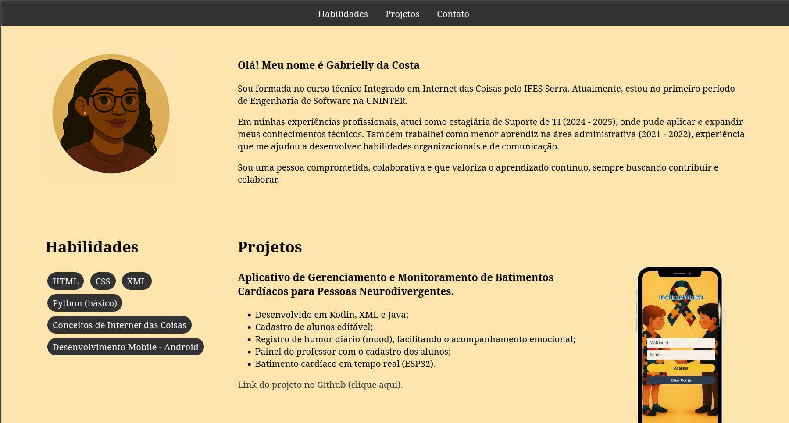

# 🌐 Meu Portfólio Pessoal

Projeto de **portfólio pessoal** criado com o intuito de apresentar minha trajetória como **desenvolvedora web e mobile**, além de compartilhar meus estudos e projetos de programação.  

---

## 📸 Demonstração

---

## 📖 Sobre o Projeto

Este portfólio foi desenvolvido para centralizar minhas informações profissionais, projetos e habilidades técnicas.  
O objetivo é ter um espaço organizado e acessível para que recrutadores e colegas possam conhecer melhor meu trabalho.  

---

## 🛠️ Tecnologias Utilizadas

- HTML5  
- CSS3  
- GitHub  

---

## 🚀 Como Acessar

🔗 [Clique aqui para ver meu portfólio online]( https://gabriellydacosta.github.io/Portifolio/)

© 2025 Gabrielly da Costa Santos
